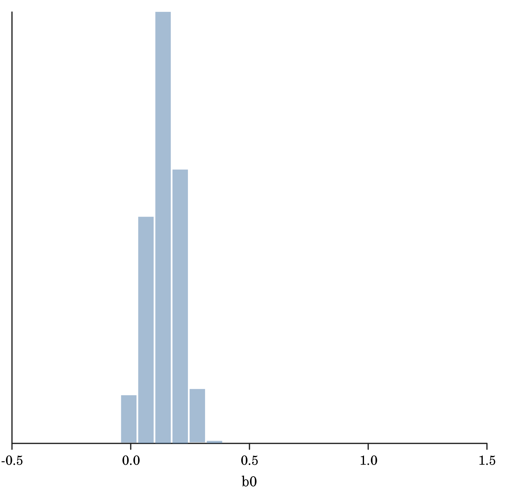
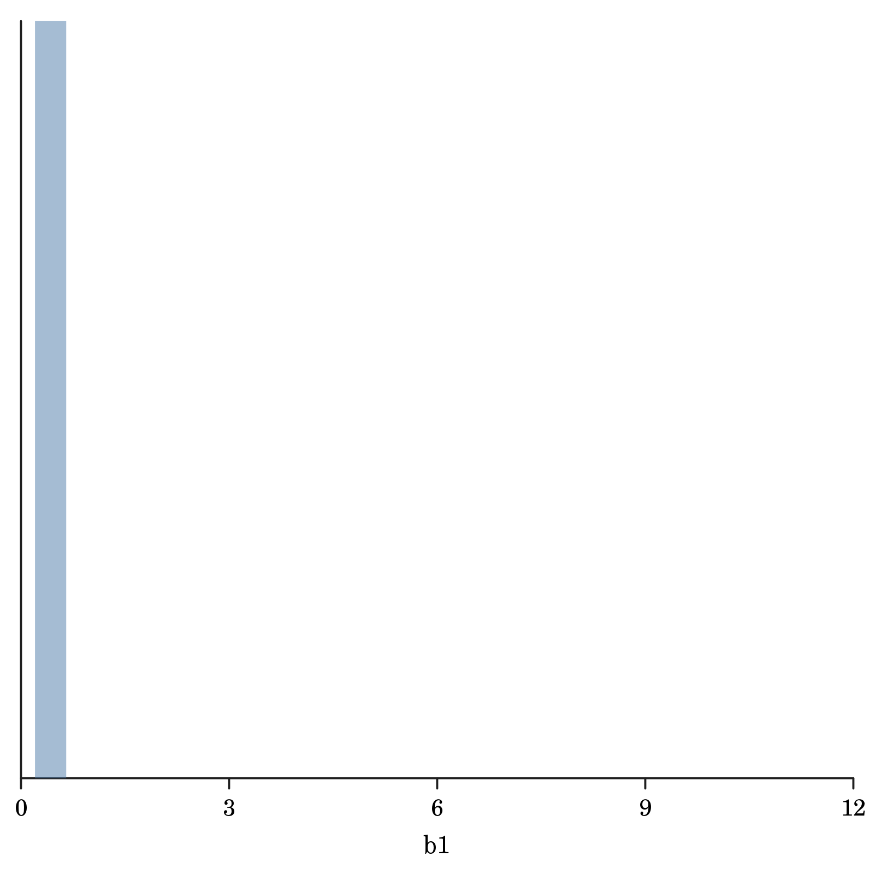

# Logistic regression

We will walk through a logistic regression example in Rainier. First some imports.

```scala
import com.stripe.rainier.core._
import com.stripe.rainier.compute._
import com.stripe.rainier.sampler._
import com.stripe.rainier.notebook._
import com.cibo.evilplot._
import com.cibo.evilplot.plot._
```

Now simulate some synthetic data from a logistic regression model that we can used to test our inference algorithm.
```scala
implicit val rng = ScalaRNG(3)
// rng: ScalaRNG = ScalaRNG(3L)
val N = 1000
// N: Int = 1000
val beta0 = 0.1
// beta0: Double = 0.1
val beta1 = 0.3
// beta1: Double = 0.3
val x = (1 to N) map { _ =>
 3.0 * rng.standardNormal
}
// x: collection.immutable.IndexedSeq[Double] = Vector(
//   0.45683916434889926,
//   -0.8482206867710047,
//   -3.499946390246375,
//   2.057870890066649,
//   0.32164677395398805,
//   -2.6632352719701196,
//   -4.097065144779961,
//   -6.3065325682867925,
//   -1.5909641672506738,
//   -2.4647525268355617,
//   -0.05886303294558001,
//   2.0798499382914013,
//   2.943728662228898,
//   0.2694808859045438,
//   1.3732753793015617,
//   -4.711384660696833,
//   0.09670474980374871,
//   0.23378474056914542,
//   -2.5059226489049844,
//   -3.618223595901852,
//   -0.651221356230115,
//   -3.025824378168222,
//   4.957870037556129,
//   -0.628600417805313,
//   -3.7652976327621017,
//   -0.5529641439024631,
//   -5.481913890621031,
//   0.02806820792472883,
//   11.563083271520913,
//   -1.735473771082788,
//   -3.424955512140646,
//   -3.749358455428164,
//   1.4577685499585498,
//   0.8469460186914712,
//   0.9061068445457567,
//   -4.372744572766216,
//   4.199604920447612,
//   6.275549704115814,
//   -3.081914620746118,
//   2.980087142305759,
//   -1.3809048271452973,
//   1.9967516625169583,
//   -0.04452980240578008,
//   -3.4454179891841097,
//   3.9225006125220414,
//   4.179182096832554,
//   2.39007985342284,
//   3.467739073407138,
// ...
val theta = x map { xi =>
 beta0 + beta1 * xi
}
// theta: collection.immutable.IndexedSeq[Double] = Vector(
//   0.23705174930466977,
//   -0.15446620603130137,
//   -0.9499839170739125,
//   0.7173612670199947,
//   0.19649403218619643,
//   -0.6989705815910359,
//   -1.1291195434339882,
//   -1.7919597704860375,
//   -0.3772892501752021,
//   -0.6394257580506685,
//   0.08234109011632601,
//   0.7239549814874203,
//   0.9831185986686694,
//   0.18084426577136314,
//   0.5119826137904685,
//   -1.3134153982090497,
//   0.1290114249411246,
//   0.17013542217074362,
//   -0.6517767946714953,
//   -0.9854670787705556,
//   -0.0953664068690345,
//   -0.8077473134504666,
//   1.5873610112668386,
//   -0.08858012534159387,
//   -1.0295892898286303,
//   -0.06588924317073891,
//   -1.5445741671863091,
//   0.10842046237741865,
//   3.568924981456274,
//   -0.4206421313248364,
//   -0.9274866536421938,
//   -1.024807536628449,
//   0.5373305649875649,
//   0.35408380560744135,
//   0.37183205336372704,
//   -1.2118233718298645,
//   1.3598814761342837,
//   1.9826649112347443,
//   -0.8245743862238354,
//   0.9940261426917276,
//   -0.3142714481435892,
//   0.6990254987550875,
//   0.08664105927826599,
//   -0.9336253967552329,
//   1.2767501837566124,
//   1.3537546290497664,
//   0.817023956026852,
//   1.1403217220221415,
// ...
def expit(x: Double): Double = 1.0 / (1.0 + math.exp(-x))
val p = theta map expit
// p: collection.immutable.IndexedSeq[Double] = Vector(
//   0.5589869718237774,
//   0.4614600476944419,
//   0.27888805639499387,
//   0.6720256856374561,
//   0.5489660614215828,
//   0.33204050264744217,
//   0.2443236226439695,
//   0.14283261792699334,
//   0.4067808629743195,
//   0.3453763591039706,
//   0.5205736496358669,
//   0.6734773356909689,
//   0.727726576023334,
//   0.5450882504231311,
//   0.625271130294861,
//   0.21191588563552372,
//   0.5322081959948742,
//   0.5424315526910841,
//   0.3425892524828606,
//   0.2718083436487413,
//   0.4761764513178313,
//   0.3083707371743497,
//   0.8302444918319943,
//   0.4778694372810624,
//   0.2631637366474374,
//   0.4835336460182698,
//   0.1758713090302059,
//   0.5270785950568566,
//   0.9725865415044519,
//   0.3963631039641238,
//   0.2834348960737922,
//   0.2640920091341764,
//   0.6311912209092291,
//   0.5876075395849288,
//   0.5919015928277188,
//   0.2293785853350222,
//   0.7957404338069952,
//   0.8789649566251105,
//   0.3047935083455133,
//   0.7298824270385345,
//   0.42207247070621734,
//   0.6679716772964549,
//   0.5216467252724707,
//   0.2821897792896918,
//   0.7818960780423133,
//   0.7947427862388886,
//   0.6936042436545213,
//   0.7577387026572504,
// ...
val yb = p map (pi => (rng.standardUniform < pi))
// yb: collection.immutable.IndexedSeq[Boolean] = Vector(
//   true,
//   true,
//   false,
//   false,
//   false,
//   false,
//   false,
//   false,
//   true,
//   false,
//   false,
//   false,
//   true,
//   true,
//   false,
//   false,
//   false,
//   true,
//   false,
//   false,
//   true,
//   false,
//   true,
//   true,
//   false,
//   true,
//   false,
//   false,
//   true,
//   true,
//   true,
//   true,
//   true,
//   false,
//   true,
//   false,
//   true,
//   true,
//   false,
//   true,
//   true,
//   false,
//   false,
//   false,
//   true,
//   true,
//   true,
//   true,
// ...
val y = yb map (b => if (b) 1L else 0L)
// y: collection.immutable.IndexedSeq[Long] = Vector(
//   1L,
//   1L,
//   0L,
//   0L,
//   0L,
//   0L,
//   0L,
//   0L,
//   1L,
//   0L,
//   0L,
//   0L,
//   1L,
//   1L,
//   0L,
//   0L,
//   0L,
//   1L,
//   0L,
//   0L,
//   1L,
//   0L,
//   1L,
//   1L,
//   0L,
//   1L,
//   0L,
//   0L,
//   1L,
//   1L,
//   1L,
//   1L,
//   1L,
//   0L,
//   1L,
//   0L,
//   1L,
//   1L,
//   0L,
//   1L,
//   1L,
//   0L,
//   0L,
//   0L,
//   1L,
//   1L,
//   1L,
//   1L,
// ...
println(y.take(10))
// Vector(1, 1, 0, 0, 0, 0, 0, 0, 1, 0)
println(x.take(10))
// Vector(0.45683916434889926, -0.8482206867710047, -3.499946390246375, 2.057870890066649, 0.32164677395398805, -2.6632352719701196, -4.097065144779961, -6.3065325682867925, -1.5909641672506738, -2.4647525268355617)
```
Now we have some data, we can build a Rainier model.
```scala
val b0 = Normal(0, 5).latent
// b0: Real = Real(-Infinity, Infinity)
val b1 = Normal(0, 5).latent
// b1: Real = Real(-Infinity, Infinity)
val model = Model.observe(y, Vec.from(x).map{xi => 
  val theta = b0 + b1*xi
  val p  = 1.0 / (1.0 + (-theta).exp)
  Bernoulli(p)
})
// model: Model = Model(
//   List(Real(-Infinity, 0.00), Real(-Infinity, 0.00)),
//   Set()
// )
```
This completes specification of the Bayesian model. We now need to sample from the implied posterior distribution.
```scala
val sampler = EHMC(warmupIterations = 2000, iterations = 1000)
// sampler: EHMC = EHMC(2000, 1000, 10, 1000)
println("Sampling...\nthis can take a while...")
// Sampling...
// this can take a while...
val bt = model.sample(sampler)
// bt: Trace = Trace(
//   List(
//     List(
//       Array(0.027026272648884048, 0.05568281934574257),
//       Array(0.027026272648884048, 0.05568281934574257),
//       Array(0.027026272648884048, 0.05568281934574257),
//       Array(0.015225333460991208, 0.059711724238531085),
//       Array(0.015225333460991208, 0.059711724238531085),
//       Array(0.015225333460991208, 0.059711724238531085),
//       Array(0.04018876690695111, 0.05246562583328857),
//       Array(0.02260002638760555, 0.05621648209607072),
//       Array(0.03171742476415395, 0.05768793363704919),
//       Array(0.029614326383920718, 0.05136249530720709),
//       Array(0.04744040370593417, 0.05482557583011456),
//       Array(0.04744040370593417, 0.05482557583011456),
//       Array(0.00870250076547567, 0.05578991873086048),
//       Array(0.008236826605159262, 0.05448834309858962),
//       Array(0.008236826605159262, 0.05448834309858962),
//       Array(0.03322934693685811, 0.0545365063278418),
//       Array(0.025977606189256916, 0.05736251262784281),
//       Array(0.03949668342023717, 0.056706622364727455),
//       Array(0.03313842770236092, 0.05683591994550737),
//       Array(0.0035515390668237386, 0.057175985431681134),
//       Array(0.03431927918975631, 0.05405306333897287),
//       Array(0.03431927918975631, 0.05405306333897287),
//       Array(0.03542194968300663, 0.05170806892742175),
//       Array(0.03013085366145564, 0.05218394860898581),
//       Array(0.02516065088867174, 0.061789132515356615),
//       Array(0.010519200064661338, 0.048668756418972246),
//       Array(0.010519200064661338, 0.048668756418972246),
//       Array(0.036645910302239265, 0.05357468738986906),
//       Array(0.030544534793262326, 0.06097827221620512),
//       Array(0.04751085953973057, 0.05322451958782323),
//       Array(0.024961979818757866, 0.05493009555760126),
//       Array(0.02789735687432789, 0.06336189751580978),
//       Array(0.046813228446533954, 0.060948504520991514),
//       Array(0.019412261860479254, 0.04427107488817411),
//       Array(0.036476852194508275, 0.06745682171115255),
//       Array(0.044491470368976584, 0.05466633430137151),
//       Array(0.03623640163799983, 0.04952901690941464),
//       Array(0.0380253533530367, 0.06365781714763381),
//       Array(0.034970030425514165, 0.05612800301525487),
//       Array(0.019218934485852, 0.055165415336927745),
//       Array(0.019218934485852, 0.055165415336927745),
//       Array(0.019218934485852, 0.055165415336927745),
//       Array(0.03512035167265465, 0.05139463246173689),
//       Array(0.03512035167265465, 0.05139463246173689),
//       Array(0.02789440760157004, 0.06006048707314184),
//       Array(0.037818531075739965, 0.06022787868751636),
// ...
println("Finished sampling.")
// Finished sampling.
val b0t = bt.predict(b0)
// b0t: List[Double] = List(
//   0.13513136324442024,
//   0.13513136324442024,
//   0.13513136324442024,
//   0.07612666730495604,
//   0.07612666730495604,
//   0.07612666730495604,
//   0.20094383453475556,
//   0.11300013193802776,
//   0.15858712382076975,
//   0.1480716319196036,
//   0.23720201852967085,
//   0.23720201852967085,
//   0.043512503827378354,
//   0.04118413302579631,
//   0.04118413302579631,
//   0.16614673468429056,
//   0.1298880309462846,
//   0.19748341710118583,
//   0.1656921385118046,
//   0.017757695334118695,
//   0.17159639594878154,
//   0.17159639594878154,
//   0.17710974841503316,
//   0.15065426830727818,
//   0.12580325444335871,
//   0.05259600032330669,
//   0.05259600032330669,
//   0.18322955151119633,
//   0.15272267396631162,
//   0.23755429769865283,
//   0.12480989909378933,
//   0.13948678437163944,
//   0.23406614223266978,
//   0.09706130930239627,
//   0.18238426097254137,
//   0.2224573518448829,
//   0.18118200818999913,
//   0.1901267667651835,
//   0.17485015212757082,
//   0.09609467242926001,
//   0.09609467242926001,
//   0.09609467242926001,
//   0.17560175836327324,
//   0.17560175836327324,
//   0.13947203800785019,
//   0.18909265537869982,
//   0.10646080562965993,
//   0.26940838906613185,
// ...
println(b0t.sum/b0t.length)
// 0.1429108951543617
```
We can plot the marginal posteriors using `show`, which works in both mdoc and Jupyter notebooks, but doesn't currently work from the Scala REPL.

```scala
val b1t = bt.predict(b1)
// b1t: List[Double] = List(
//   0.27841409672871287,
//   0.27841409672871287,
//   0.27841409672871287,
//   0.2985586211926554,
//   0.2985586211926554,
//   0.2985586211926554,
//   0.2623281291664429,
//   0.2810824104803536,
//   0.2884396681852459,
//   0.25681247653603545,
//   0.2741278791505728,
//   0.2741278791505728,
//   0.2789495936543024,
//   0.2724417154929481,
//   0.2724417154929481,
//   0.272682531639209,
//   0.28681256313921405,
//   0.2835331118236373,
//   0.28417959972753687,
//   0.28587992715840566,
//   0.27026531669486437,
//   0.27026531669486437,
//   0.2585403446371088,
//   0.26091974304492904,
//   0.3089456625767831,
//   0.24334378209486124,
//   0.24334378209486124,
//   0.2678734369493453,
//   0.3048913610810256,
//   0.2661225979391162,
//   0.27465047778800633,
//   0.3168094875790489,
//   0.3047425226049576,
//   0.22135537444087056,
//   0.33728410855576274,
//   0.27333167150685755,
//   0.2476450845470732,
//   0.31828908573816905,
//   0.28064001507627434,
//   0.27582707668463874,
//   0.27582707668463874,
//   0.27582707668463874,
//   0.25697316230868444,
//   0.25697316230868444,
//   0.3003024353657092,
//   0.3011393934375818,
//   0.25743467646576523,
//   0.3344900377892695,
// ...
println(b1t.sum/b1t.length)
// 0.29531373214342266
```

So we see that mdoc documents provide a nice way to document Rainier modelling workflows, similar to the way people often document R workflows using R Markdown.
